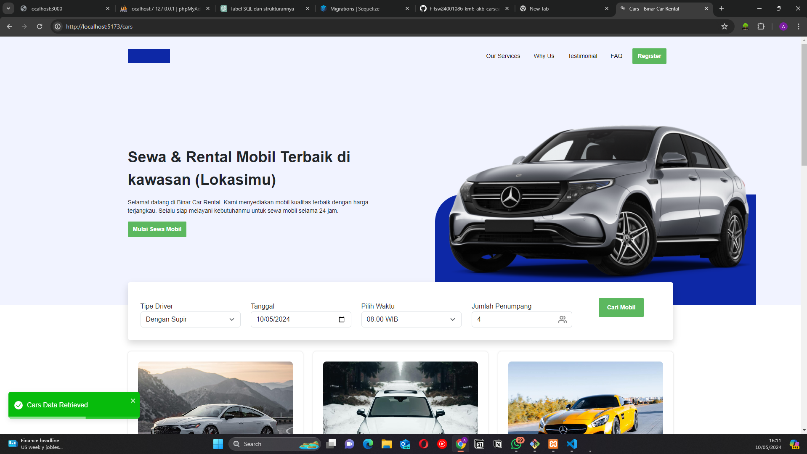

# Challenge 6 MSIB Binar Academy

## Backend

REST API Using this [Repository](https://github.com/akbarrahmatm/f-fsw24001086-km6-akb-carmanagementdashboard-ch4)

## Installation

- Clone This Repository
- `npm i`
- `npm run dev`

## Stack

- React.JS
- Vite
- React Dom Router
- React Helmet
- React Toastify

## Preview

<p align="center" width="100%">
     
</p>

## Documentation

#### Landing Page

```http
  GET /
```

#### Cars Search Page

```http
  GET /cars
```
